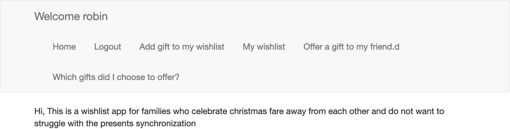

# What does this app do
when the moment of christmas come, for family where people are fare away from each other 
making a wishlist can ba daunting. In my family we use google sheets to share our wishlits accross continents 
but it makes it hard to synchronize for the gift buying and might end up buying the same present as your cousin for your 
grandmother :/. This is a draft of an app that would solve this problem.

# Screenshot

# How to run it ? 
1. Create the databases: `ipython app/init_tables.py`
2. Run flask with `flask run` 
3. Access the website on `localhost:5000`  

# TODO 
- At the moment, the website is **NOT SECURE AT ALL** this should be improved
- There is some code duplicates in `routes.md` > to be fixed
- ~~Add a docker file to deploy the app easily in a cloud~~ 
- Improve the style of the site

# Thanks
A big thanks to the [Flask mega tutorial](https://blog.miguelgrinberg.com/post/the-flask-mega-tutorial-part-i-hello-world) 
which was a great inspiration for this project.

# Warning 
At the moment, the website is **NOT SECURE AT ALL** do not use it in production. 

